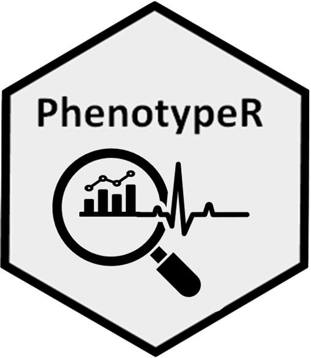
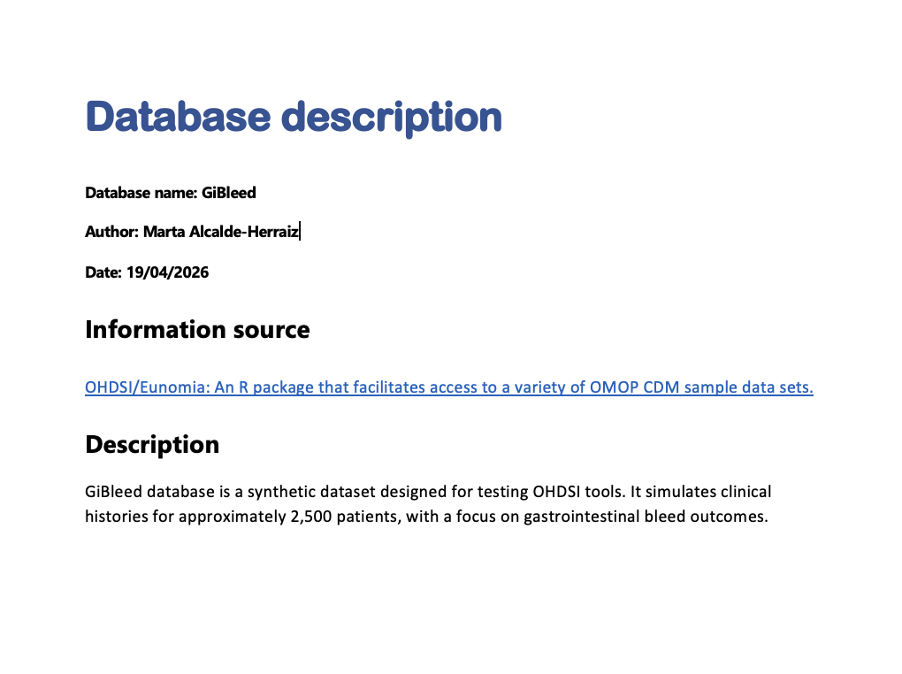

---
format:
  revealjs: 
    theme: [simple, ../styleSS25.scss]
    incremental: true   
    slide-number: true
    chalkboard: true
    preview-links: auto
    margin: 0.07
    code-link: true
    code-line-numbers: false
    height: 900
    width: 1600
    footer: |
      <div style="position: relative; width: 100%;">
        <div style="text-align: center; font-weight: 500;">OHDSI EUROPE 2026</div>
        <div style="position: fixed; top: 20px; right: 20px;"><a href="../index.qmd" style="text-decoration: none;">⬅ Back to Workshop</a></div>
      </div>
execute:
  echo: true
  eval: true
editor: visual
---

# PhenotypeR

Review codelists and cohorts in OMOP CDM

<p style="text-align:center;">



</p>

## Introduction

-   PhenotypeR package can help us to assess the research-readiness of a set of cohorts we have defined.

::: {style="margin-bottom: 10px;"}
:::

-   The code is publicly available in OHDSI's GitHub repository [PhenoypeR](https://github.com/OHDSI/PhenotypeR).

::: {style="margin-bottom: 10px;"}
:::

-   PhenotypeR 0.3.4 is available in [CRAN](https://cran.r-project.org/web/packages/PhenotypeR/index.html){.link}.

::: {style="margin-bottom: 10px;"}
:::

-   Vignettes with further information can be found in the package [website](https://ohdsi.github.io/PhenotypeR/){.link}.

## Set of Functions: Individual Diagnostics Assessment

::: {style="margin-bottom: 10px;"}
:::

::::::: columns
:::: {.column width="45%"}
-   **Database diagnostics**

    -   `databaseDiagnostics()`

::: {style="margin-bottom: 10px;"}
:::

-   **Codelist diagnostics**

    -   `codelistDiagnostics()`
::::

:::: {.column width="55%"}
-   **Cohort diagnostics**

    -   `cohortDiagnostics()`

::: {style="margin-bottom: 10px;"}
:::

-   **Population diagnostics**

    -   `populationDiagnostics()`
::::
:::::::

## Set of Functions: Phenotype Diagnostics

-   Comprises all the diagnostics that are being offered in this package.

. . .

```{r, eval = FALSE}
result <- phenotypeDiagnostics(
  cohort,
  databaseDiagnostics = list(),
  codelistDiagnostics = list(),
  cohortDiagnostics = list(),
  populationDiagnostics = list()
)
```

-   Run only some of the diagnostics:

. . .

```{r, eval = FALSE}
result <- phenotypeDiagnostics(
  cohort,
  databaseDiagnostics = NULL,
  codelistDiagnostics = list(),
  cohortDiagnostics = NULL,
  populationDiagnostics = list()
)
```

## Database Diagnostics

-   Summarise the database metadata including:
    1.  **Snapshot**
    2.  Summary of the **person table**
    3.  Summary of the **observation period**
    4.  Summary of the **clinical tables** (i.e., *condition_occurrence*) where the concepts of the codelist defining your cohort are found.

## Database Diagnostics

```{r, eval = FALSE}
db_diagnostics <- databaseDiagnostics(
  cohort,
  cohortId = NULL,
  snapshot = TRUE,
  personTableSummary = TRUE,
  observationPeriodsSummary = TRUE,
  clinicalRecordsSummary = TRUE
)

# Modify databaseDiagnostics in phenotypeDiagnostics:
result <- phenotypeDiagnostics(
  cohort,
  databaseDiagnostics = list(
    "cohortId" = c(1,2),
    "snapshot" = FALSE
  )
)
```

## Codelist Diagnostics

-   Summarise the codelist associated with your cohort including:
    1.  **Achilles codes use** (only if ACHILLES tables are present)
    2.  **Orphan codes use** (only if ACHILLES tables are present)
    3.  **Cohort code use**
    4.  **Measurement code use** (only if measurement concepts are present in your codelist)
    5.  **Drug diagnostics** (only if drug concepts are present in your codelist)

## Codelist Diagnostics

```{r, eval = FALSE}
cl_diagnostics <- codelistDiagnostics(
  cohort,
  cohortId = NULL,
  achillesCodeUse = TRUE,
  orphanCodeUse = TRUE,
  cohortCodeUse = TRUE,
  drugDiagnostics = TRUE,
  measurementDiagnostics = TRUE,
  measurementDiagnosticsSample = 20000,
  drugDiagnosticsSample = 20000
)

# Modify codelistDiagnostics in phenotypeDiagnostics:
result <- phenotypeDiagnostics(
  cohort,
  codelistDiagnostics = list(
    "cohortId" = c(1,2),
    "achillesCodeUse" = FALSE
  )
)
```

## Cohort Diagnostics

-   Summarise your cohort characteristics:
    1.  **Cohort count & attrition**
    2.  **Cohort characteristics**: Baseline characteristics of your cohort
    3.  **Large scale characteristics**: Summary of the records from clinical tables within a time window.
    4.  **Compare large scale characteristics**: Comparison of the LSC with a matched (by age & sex) cohort.
    5.  **Compare cohorts**: Overlap and timing between cohorts (only if more than one cohort are present).
    6.  **Cohort survival**: Survival curves

## Cohort Diagnostics

```{r, eval = FALSE}
c_diagnostics <- cohortDiagnostics(
  cohort,
  cohortId = NULL,
  cohortCount = TRUE,
  cohortCharacteristics = TRUE,
  largeScaleCharacteristics = TRUE,
  compareCohorts = TRUE,
  cohortSurvival = FALSE,
  cohortSample = 20000,
  matchedSample = 1000
)

# Modify cohortDiagnostics in phenotypeDiagnostics:
result <- phenotypeDiagnostics(
  cohort,
  cohortDiagnostics = list(
    "cohortSample" = 1000
  )
)
```

## Population Diagnostics

-   Contextualise your cohort including:
    1.  **Incidence**
    2.  **Prevalence**

## Population Diagnostics

```{r, eval = FALSE}
c_diagnostics <- populationDiagnostics(
  cohort,
  cohortId = NULL,
  incidence = TRUE,
  periodPrevalence = TRUE,
  populationSample = 1e+05,
  populationDateRange = as.Date(c(NA, NA))
)

# Modify populationDiagnostics in phenotypeDiagnostics:
result <- phenotypeDiagnostics(
  cohort,
  populationDiagnostics = list(
    "populationSample" = 10000
  )
)
```

## Extra: Create a database description manually and add it to the shiny app!

```{r, eval = FALSE}
downloadDatabaseDescriptionTemplate(
  directory = here(),
  name = "GiBleed") # Same name of your database!!!!
```



## Extra: Create a clinical description manually and add it to the shiny app!

```{r, eval = FALSE}
downloadClinicalDescriptionTemplate(
  directory = here(),
  name = "type_2_diabetes") # Same name of your cohort!!!!
```


## Extra: Create clinical expectations for your cohorts:

```{r, eval = TRUE}
library(dplyr)
library(PhenotypeR)
exp <- tibble(
  "cohort_name" = "type_2_diabetes",
  "estimate" = c("Median age of incident cases", 
                 " Survival at five years"),
  "value" = c("45 to 65",
              "85% to 95%"),
  "diagnostics" = c("cohort_characteristics",
                    "cohort_survival"),
  "source" = "Marta"
)
tableCohortExpectations(exp)
```

## Final: Create a shiny app to visualise all the results!

-   Create a shiny app to visualize all the results

. . .

```{r, eval = FALSE}
shinyDiagnostics(result = result, 
                 directory = here(), 
                 minCellCount = 5, 
                 expectationsDir =  here("expectations"), 
                 clinicalDescriptionsDir = here("clinical_descriptions"),
                 databaseDescriptionsDir = here("database_descriptions"),
                 removeEmptyTabs = FALSE)
```

See the results in the [shiny app](https://dpa-pde-oxford.shinyapps.io/PhenotypeRShiny_OHDSIEuropeWorkshop/)

# Exercise - Run your PhenotypeR analysis and create your shiny app!

## 1. Load the packages

-   We will now run PhenotypeR for three cohorts of hypertension, warfarin users, and people with a measurement of prostate specific antigen level

-   Let's start by loading the required packages and using [https://ohdsi.github.io/omock/](omock) package to create a mock CDM.

. . .

```{r, eval = FALSE}
# Install all the packages:
install.packages(c("omock", "here", "OmopConstructor", "CohortConstructor",
                   "CohortSurvival", "omopgenerics", "readr", "duckdb", "PhenotypeR"))

# Load all the packages
library(omock)
library(here)
library(PhenotypeR)
library(OmopConstructor)
library(CohortConstructor)
library(CohortSurvival)
library(omopgenerics)
library(readr)

# Create mock CDM
cdm <- mockCdmFromDataset(datasetName = "synpuf-1k_5.3", 
                          source = "duckdb")
cdm <- cdm |> buildAchillesTables()

```

## 2. Instantiate your cohorts

-   We will now instantiate our cohorts using [CohortConstructor](https://ohdsi.github.io/CohortConstructor/) R Package.

. . .

```{r, eval=FALSE}
# Define code list for your cohort
codes <- list(
  "hypertension" = c(320128L),
  "users_of_warfarin" = c(1310149L, 40163554L),
  "measurement_of_prostate_specific_antigen_level" = c(2617206L)
)

# Instantiate your cohort
cdm[["study_cohorts"]] <- conceptCohort(cdm,
                                        conceptSet = codes,
                                        name = "study_cohorts")
```

## 3. Your turn! Create a database description for our database

To create a database description, follow the following instructions:

. . .

0.  Check your database name using `cdmName(cdm)`

. . .

1.  Download a template using `downloadDatabaseDescriptionTemplate()`. Remember that the docx files **MUST** have the same name as the database!!!

. . .

Help: You can check the arguments of the function using:

`??downloadDatabaseDescriptionTemplate` or in the [**PhenotypeR website**](https://ohdsi.github.io/PhenotypeR/reference/index.html)

. . .

2.  Fill the template with the following information (please copy paste):

. . .

```{r, eval=FALSE}
Information source: 
"OHDSI/Eunomia: An R package that facilitates access to a variety of OMOP CDM sample data sets."

Description: 
"synput-1k_5.3 is a synthetic dataset designed for testing OHDSI tools. It is based on a subsample of Medicare claims data standardised to the OMOP Common Data Model (CDM) version 5.3.  It contains approximately records for 1k participants."

```

## 4. Your turn! Create clinical descriptions for this cohorts

To create clinical descriptions for the previous cohorts, follow the following instructions:

. . .

0.  Check the name of your cohorts using `getCohortName(cdm)`

. . .

1.  Download three templates for each of the cohorts using `downloadClinicalDescriptionTemplate()`. Remember that the docx files **MUST** have the same name as the cohorts!!!

. . .

`??downloadDatabaseDescriptionTemplate` or in the [**PhenotypeR website**](https://ohdsi.github.io/PhenotypeR/reference/index.html)

## 4. Your turn! Create clinical descriptions for this cohorts

2.  Fill the templates with the following information (please copy paste):

. . .

```{r, eval=FALSE}
# Hypertension
Information source: 
"Dynamed (Home - DynaMed)"

Introduction: 
"Hypertension is a sustained elevation of systemic arterial blood pressure, most commonly defined as a systolic blood pressure (BP) ≥ 140 mm Hg or diastolic BP ≥ 90 mm Hg, but definitions vary by professional organization and cardiovascular risk.
Other names include: primary hypertension, essential hypertension, idiopathic hypertension, sustained hypertension."

Complications:
"Hypertension is a risk factor for: Coronary artery disease (CAD), Heart failure, Chronic kidney disease, Stroke, Intracerebral hemorrhage, Transient ischemic attack (TIA), Peripheral artery disease (PAD), Aortic regurgitation, Atrial flutter, Mild cognitive impairment (MCI)."

Phenotyping plan: 
"Inclusion criteria: At least one record of a diagnosis code for essential hypertension (ConceptId = 320128L). 
Index date: Date of the first occurrence of the essential hypertension diagnosis code. 
Exit criteria: As it is considered a chronic condition, once a patient enters the cohort they remain in it until the end of their observation period in the database."
```

## 4. Your turn! Create clinical descriptions for this cohorts

2.  Fill the templates with the following information (please copy paste):

. . .

```{r, eval=FALSE}
# Warfarin users
Information source: 
"Gemini (https://gemini.google.com/)"

Introduction: 
"Warfarin is an oral anticoagulant that interferes with the hepatic synthesis of Vitamin K-dependent clotting factors (II, VII, IX, and X). It is primarily indicated for the prophylaxis and treatment of venous thrombosis, pulmonary embolism, and thromboembolic complications associated with atrial fibrillation (AFib) or cardiac valve replacement."

Phenotyping plan: 
"Inclusion criteria: At least one record in the drug_exposure table of warfarin prescription. Multiple records per person are allowed.
Index date: Date of the recorded drug exposure.
Washout period: No washout period is used."
```

## 4. Your turn! Create clinical descriptions for this cohorts

2.  Fill the templates with the following information (please copy paste):

. . .

```{r, eval=FALSE}
# Measurement of antigen specific cancer
Information source: 
"Dynamed (https://www.dynamed.com/)"

Introduction: 
"Measurement of prostate specific antigen in serum for the detection and management of benign prostatic hyperplasia and prostate cancer. 
Other names include: PSA measurement, PSA - Prostate-specific antigen level, PSA - Serum prostate specific antigen level, tPSA measurement - Total prostate specific antigen measurement"

Phenotyping plan: 
"Inclusion criteria: A record in the measurement table where the measurement_concept_id is 2617206L. Multiple records per person are allowed.
Index date:Measurement date of the recorded PSA test."
```

## 5. Get cohort expectations

Run the following bit of code to get mock expectations for your cohorts:

. . .

```{r, eval=FALSE}
url <- "https://raw.githubusercontent.com/OHDSI/OHDSI-EU-2026-Workshop/main/PhenotypeR/expectations.csv"

expectationsDir <- "..." # Write here the directory where to save the expectations

download.file(url, 
              destfile = here(expectationsDir, "expectations.csv"), 
              mode = "wb")
```

## 6. Your turn! Run phenotypeDiagnostics

We'll now run `phenotypeDiagnostics()` with the following specifications:

. . .

-   For **databaseDiagnostics**, use the default settings.
-   For **codelistDiagnostics**:
    -   Set `measurementDiagnosticsSample = 1000`
    -   Set `drugDiagnosticsSample = 1000`

## 6. Your turn! Run phenotypeDiagnostics

-   For **cohortDiagnostics**:
    -   Run the default diagnostics AND cohortSurvival
    -   Do not use any cohort sample
    -   Use a `matchedSample = 1000`
-   For **populationDiagnostics**:
    -   Use a `populationSample = 10000`

. . .

Do you want to check your answer? Go to the following slide!

## 6. Your turn! Run phenotypeDiagnostics

. . .

Are you 100% sure that you're ready to see the answer?

## 6. Solution:

```{r, eval=FALSE}
result <- phenotypeDiagnostics(cohort = cdm[["study_cohorts"]], 
                               databaseDiagnostics = list(), 
                               codelistDiagnostics = list(
                                 "measurementDiagnosticsSample" = 1000,
                                 "drugDiagnosticsSample" = 1000
                               ),
                               cohortDiagnostics = list(
                                 "cohortSurvival" = TRUE,
                                 "cohortSample" = NULL,
                                 "matchedSample" = 1000
                               ),
                               populationDiagnostics = list(
                                 "populationSample" = 10000
                               ))
```

## 7. Your turn! Run your shiny app!

Let us now create the shiny app using `shinyDiagnostics()`! To do that, complete the following spaces:

. . .

```{r, eval=FALSE}
shinyDiagnostics(result, 
                 directory = "...", 
                 expectations = "...", 
                 clinicalDescriptionsDir = "...", 
                 databaseDescriptionsDir = "...",
                 minCellCount = 1, 
                 open = TRUE
                 ) 
```

Help: You can check the arguments of the function using:

`??shinyDiagnostics` or in the [**PhenotypeR website**](https://ohdsi.github.io/PhenotypeR/reference/index.html)

## 8. Your turn! Answer the following questions from the shiny app:

Use the Shiny App to answer the following questions. The next slide lists questions from 1-20. After that, you'll find the same questions again with hints to guide you.

After that, you'll find the answers!

## 8. Your turn! Answer the following questions from the shiny app:

1.  Check that database descriptions and clinical descriptions have been uploaded correctly
2.  When does the database observation period start and end?
3.  How many females and males are in the database?
4.  What is the average number of days during the first observation period?
5.  What is the average number of records per person in the drug_exposure table?

## 8. Your turn! Answer the following questions from the shiny app:

6.  According to ACHILLES tables, how many records of essential hypertension (concept ID = 320128) are in the database?
7.  Which is the orphan code for the cohort *hypertension* with less number of records in the database?
8.  How many people have the concept *Prostate cancer screening; prostate specific antigen test (psa)* (concept ID = 2617206) in our cohort *measurement of prostate specific antigen level*?
9.  For our cohort *measurement of prostate specific antigen level*, how many days are between measurements (in average)?
10. How many records are excluded after merging overlapping records in the cohort *hypertension*?

## 8. Your turn! Answer the following questions from the shiny app:

11. How many females are within the cohort *hypertension*?
12. How many people get a prescription of *tolazamide 250 MG Oral Tablet* (concept ID = 1502811) after 30 days of having an *hypertension* diagnosis?
13. Within the window 366 to Inf and for the concept *Systemic lupus erythematosus* (concept ID = 257628), what is the standardised mean differences between the hypertension sampled and the matched cohorts?
14. How many people are in both, *hypertension* and *users of warfarin* cohorts?
15. What is the average number of days between people entering the *hypertension* cohort and then to the *users of warfarin* cohort?

## 8. Your turn! Answer the following questions from the shiny app:

16. How many people die in the *hypertension* cohort? Check if it is aligned with the cohort expectations!
17. What is the incidence of *hypertension* between 1/01/2009 to 31/12/2009 in our subsample of 10,000?
18. What is the prevalence of *hypertension* between 1/01/2009 to 31/12/2009 in our subsample of 10,000?
19. What is the prevalence of *hypertension* between 1/01/2009 to 31/12/2009 in our subsample of 10,000 only among Females?
20. Save the prevalence plot as a png image.

## 8. Your turn! Answer the following questions from the shiny app (with HINTS)

1.  Check that database descriptions and clinical descriptions have been uploaded correctly

    -   **HINT:** Go to Background tab. Notice that *clinical_descriptions* has an expandable menu on the left where you can choose to see the phenotyping plan

2.  When does the database observation period start and end?

    -   **HINT:** Go to Database Diagnostics / Snapshot

3.  How many females and males are in the database?

    -   **HINT:** Go to Database Diagnostics / Person table summary

4.  What is the average number of days during the first observation period?

    -   **HINT:** Go to Database Diagnostics / Observation Periods and scroll down until you see the observation period cardinal number 1.

## 8. Your turn! Answer the following questions from the shiny app (with HINTS)

5.  What is the average number of records per person in the drug_exposure table?

    -   **HINT:** Go to Database Diagnostics / Clinical tables and filter (using the expandable menu on the left) for the drug_exposure table

6.  According to ACHILLES tables, how many records of essential hypertension (concept ID = 320128) are in the database?

    -   **HINT:** Go to Codelist Diagnostics / Achilles code use and expand the results for the cohort *hypertension*

7.  Which is the orphan code for the cohort *hypertension* with less number of records in the database?

    -   **HINT:** Go to Codelist Diagnostics / Orphan codes and expand the results for the cohort *hypertension*. You can arrange the results tapping into the column *synpuf-1k: Record count*

## 8. Your turn! Answer the following questions from the shiny app (with HINTS)

8.  How many people have the concept *Prostate cancer screening; prostate specific antigen test (psa)* (concept ID = 2617206) in our cohort *measurement of prostate specific antigen level*?

    -   **HINT:** Go to Codelist Diagnostics / Cohort code use, select the cohort *measurement of prostate specific antigen level* and expand its results.

9.  For our cohort *measurement of prostate specific antigen level*, how many days are between measurements (in average)?

    -   **HINT:** Go to Codelist Diagnostics / Measurement diagnostics and select the cohort *measurement of prostate specific antigen level*

10. How many records are excluded after merging overlapping records in the cohort *hypertension*?

    -   **HINT:** Go to Cohort Diagnostics / Cohort count / Attrition and select the cohort *hypertension*

## 8. Your turn! Answer the following questions from the shiny app (with HINTS)

11. How many females are within the cohort *hypertension*?

    -   **HINT:** Go to Cohort Diagnostics / Cohort characteristics and select the cohort *hypertension*

12. How many people get a prescription of *tolazamide 250 MG Oral Tablet* (concept ID = 1502811) after 30 days of having an *hypertension* diagnosis?

    -   **HINT:** Go to Cohort Diagnostics / Large scale characteristics and select the cohort *hypertension*. Use the left expandable menu to select *drug_exposure* table and the window c(1,30)


## 8. Your turn! Answer the following questions from the shiny app (with HINTS)

13. Within the window 366 to Inf and for the concept *Systemic lupus erythematosus* (concept ID = 257628), what is the standardised mean differences between the hypertension sampled and the matched cohorts?

    -   **HINT:** Go to Cohort Diagnostics / Compare Large scale characteristics and select the cohort *hypertension sampled* as reference cohort, and *hypertension matched* as a comparator cohort. Use the left expandable menu to select *condition_occurrence* table and the window c(366,Inf)

14. How many people are in both, *hypertension* and *users of warfarin* cohorts?

    -   **HINT:** Go to Cohort Diagnostics / Compare cohorts / Cohort Overlap and select the cohort *hypertension*


## 8. Your turn! Answer the following questions from the shiny app (with HINTS)

15. What is the average number of days between people entering the *hypertension* cohort and then to the *users of warfarin* cohort?

    -   **HINT:** Go to Cohort Diagnostics / Compare cohorts / Cohort Timing and select the cohort *hypertension*

16. How many people die in the *hypertension* cohort? Check if it is aligned with the cohort expectations!

    -   **HINT:** Go to Cohort Diagnostics / Cohort Survival and select the cohort *hypertension*. Explore the table and the plot!

17. What is the incidence of *hypertension* between 1/01/2009 to 31/12/2009 in our subsample of 10,000?

    -   **HINT:** Go to Population Diagnostics / Incidence and select the cohort *hypertension*

## 8. Your turn! Answer the following questions from the shiny app (with HINTS)

18. What is the prevalence of *hypertension* between 1/01/2009 to 31/12/2009 in our subsample of 10,000?

    -   **HINT:** Go to Population Diagnostics / Prevalence and select the cohort *hypertension*

19. What is the prevalence of *hypertension* between 1/01/2009 to 31/12/2009 in our subsample of 10,000 only among Females?

    -   **HINT:** Go to Population Diagnostics / Prevalence and select the cohort *hypertension*. Expand the menu on the left to select Female sex.

20. Save the prevalence plot as a png image.

    -   **HINT:** Go to Population Diagnostics / Prevalence and select the cohort *hypertension*. Select the small arrow pointing to a box on the top left of the figure.

## 8. Your turn! Answer the following questions from the shiny app (ANSWERS)

1.  Check that database descriptions and clinical descriptions have been uploaded correctly

2.  When does the database observation period start and end?

    -   **RE:** Start is in 2008-01-01 and end in 2010-12-31

3.  How many females and males are in the database?

    -   **RE:** Females 498 (49.80%) and males 502 (50.20%)

4.  What is the average number of days during the first observation period?

    -   **RE:** Mean (SD) = 994.16 (257.95)

5.  What is the average number of records per person in the drug_exposure table?

    -   **RE:** Mean (SD) = 56.75 (54.13)

## 8. Your turn! Answer the following questions from the shiny app (ANSWERS)

6.  According to ACHILLES tables, how many records of essential hypertension (concept ID = 320128) are in the database?

    -   **RE:** 5,617

7.  Which is the orphan code for the cohort *hypertension* with less number of records in the database?

    -   **RE:** *Complications affecting other specified body systems, not elsewhere classified, hypertension*, with 7 records.

8.  How many people have the concept *Prostate cancer screening; prostate specific antigen test (psa)* (concept ID = 2617206) in our cohort *measurement of prostate specific antigen level*?

    -   **RE:** 124

## 8. Your turn! Answer the following questions from the shiny app (ANSWERS)

9.  For our cohort *measurement of prostate specific antigen level*, how many days are between measurements (in average)?

    -   **RE:** Median \[Q25 - Q75\] = 226 \[88 – 571\]

10. How many records are excluded after merging overlapping records in the cohort *hypertension*?

    -   **RE:** 1,406

11. How many females are within the cohort *hypertension*?

    -   **RE:** N (%) = 2,145 (50.94%)

12. How many people get a prescription of *tolazamide 250 MG Oral Tablet* (concept ID = 1502811) after 30 days of having an *hypertension* diagnosis?

    -   **RE:**  1

## 8. Your turn! Answer the following questions from the shiny app (ANSWERS)

13. Within the window 366 to Inf and for the concept *Systemic lupus erythematosus* (concept ID = 257628), what is the standardised mean differences between the hypertension sampled and the matched cohorts?

    -   **RE:**  1.414

14. How many people are in both, *hypertension* and *users of warfarin* cohorts?

    -   **RE:**   52

15. What is the average number of days between people entering the *hypertension* cohort and then to the *users of warfarin* cohort?

    -   **RE:**  229

## 8. Your turn! Answer the following questions from the shiny app (ANSWERS)

16. How many people die in the *hypertension* cohort? Check if it is aligned with the cohort expectations!

    -   **RE:**  5. If we observe the plot, we can see that the maximum number of follow-up days are 1077 (equivalent to 2.95 years), and a survival probability of approximately 97%. The expectations say that the average survival after 5 years of the diagnosis is 85% to 95%.

17. What is the incidence of *hypertension* between 1/01/2009 to 31/12/2009 in our subsample of 10,000?

    -   **RE:** Incidence 100,000 person-years [95% CI] = 41,413.76 (34,550.51 - 49,241.10)

## 8. Your turn! Answer the following questions from the shiny app (ANSWERS)

18. What is the prevalence of *hypertension* between 1/01/2009 to 31/12/2009 in our subsample of 10,000?

    -   **RE:**  Prevalence [95% CI] = 0.64 (0.60 - 0.67)

19. What is the prevalence of *hypertension* between 1/01/2009 to 31/12/2009 in our subsample of 10,000 only among Females?

    -   **RE:** Prevalence [95% CI] = 0.65 (0.61 - 0.69)

## PhenotypeR

::::: {style="display: flex; align-items: center; justify-content: space-between;"}
::: {style="flex: 1;"}
👉 [**Packages website**](https://ohdsi.github.io/PhenotypeR/)\
👉 [**CRAN link**](https://cran.r-project.org/package=PhenotypeR)\
👉 [**Manual**](https://cran.r-project.org/web/packages/PhenotypeR/PhenotypeR.pdf)

📧 <a href="mailto:marta.alcaldeherraiz@ndorms.ox.ac.uk">marta.alcaldeherraiz\@ndorms.ox.ac.uk</a>
:::

::: {style="flex: 1; text-align: center;"}

:::
:::::
